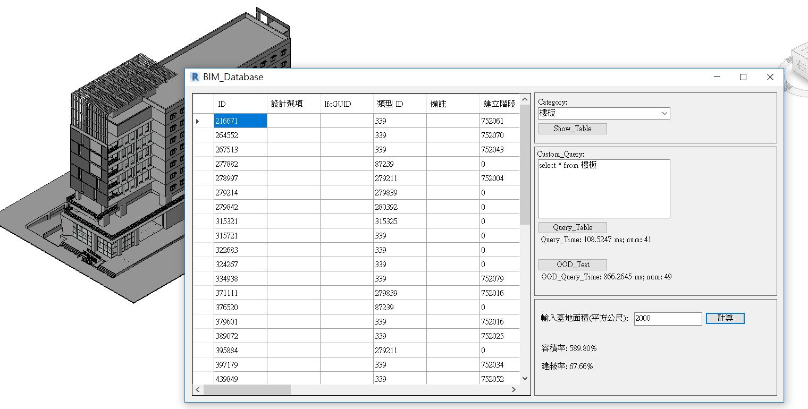

# BIM_Database

## Describition

This is a final project of Couse Database system.

I phase BIM's information to MySQL, and use a WinForm connect to the database. The form can show the information of BIM's elements, by the way, it can also use custom SQL language do what you want to do.

The project target is comparing with Relational DataBase and Object-Oriented DataBase in the BIM system.

The result of the experiment shows that RDB will ten times faster than ODB. Because of ODB should take a lot of time on inheritance class. RDB will just show the table of the database. 
